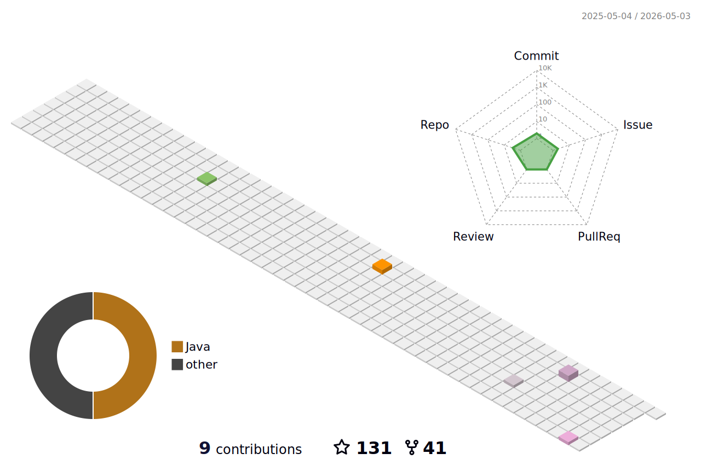

<!--   my-header-img -->

<!--   my-ticker -->    

<h3 align="left">Languages and Tools:</h3>

                

:trophy: Github Profile Trophy

  

  

<!--   profile-green-animate -->

### How to reach me 📫 
- **Email：644968328@qq.com**
- **WeChat：lx6688s**

### Profile Views

 
