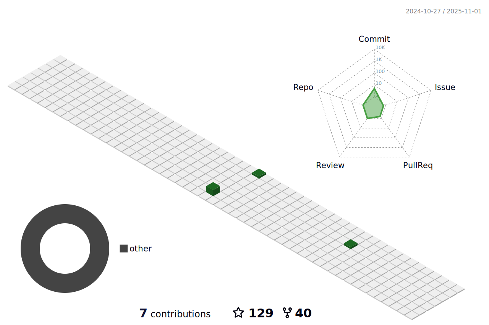

<!--   my-header-img -->

<!--   my-ticker -->    

<h1 align="center">Hi 👋, I'm Li Xiao Shuang</h1>
<h3 align="center">A passionate back-end developer from Beijing, China</h3>

  

  

- 🌱 I’m currently learning **Golang、Dokcer、Kubernetes、Service Mesh**
- [Alibaba Nacos(服务注册与发现、配置) Committer](https://github.com/alibaba/nacos)
- [polaris (服务发现和治理中心) Committer](https://github.com/polarismesh)
- [dtm (分布式事务) Committer](https://github.com/dtm-labs/dtm)
- [Apache RocketMQ (分布式消息引擎) Contributor](https://github.com/apache/rocketmq)
- [Apache EventMesh (动态事件驱动) Contributor](https://github.com/apache/incubator-eventmesh)

- 📫 How to reach me 

     **Email：644968328@qq.com**
     
     **WeChat：lx6688s**

<h3 align="left">Languages and Tools:</h3>

                

&nbsp;

| .                                                                                                                                       | .                                                                                                                         |
|-----------------------------------------------------------------------------------------------------------------------------------------|---------------------------------------------------------------------------------------------------------------------------|
|  |  |

</img>

<!--   profile-green-animate -->

<!--   grid-snake -->

<!--   skyline 

-->

<!--  2d history skills -->
</img>
